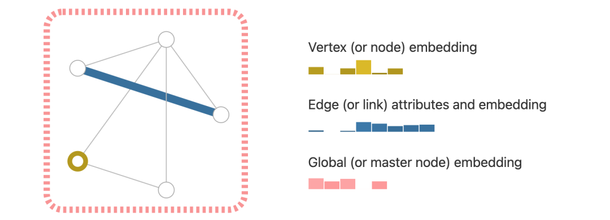
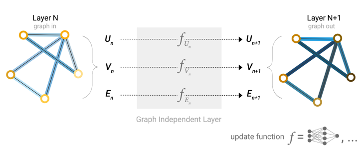
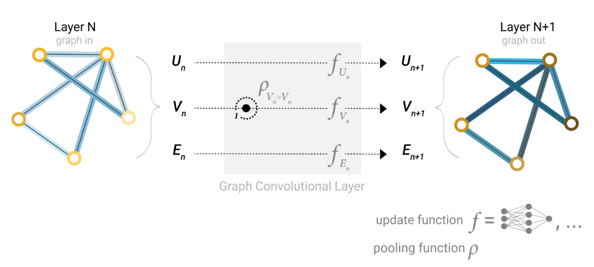
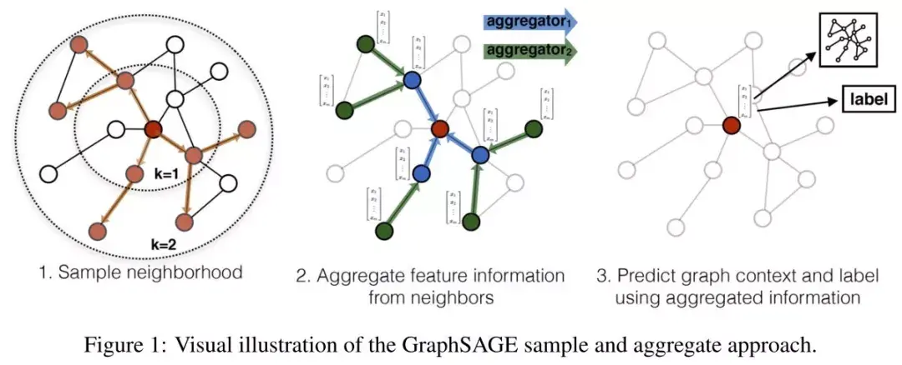
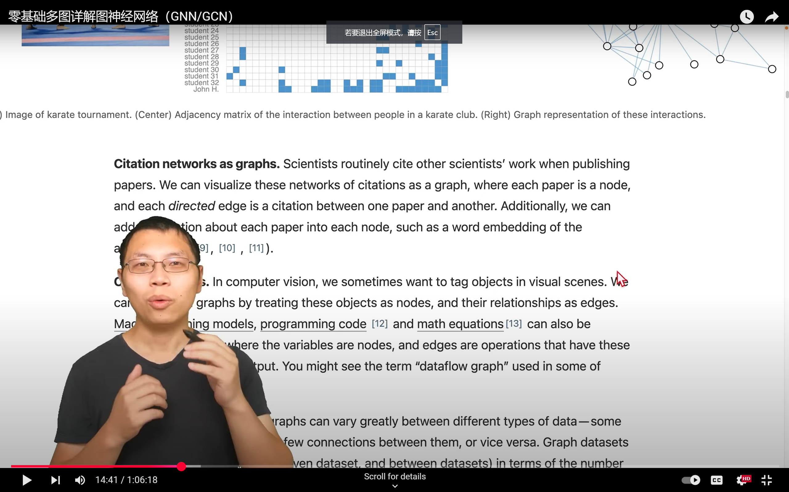
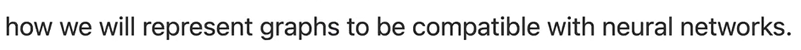
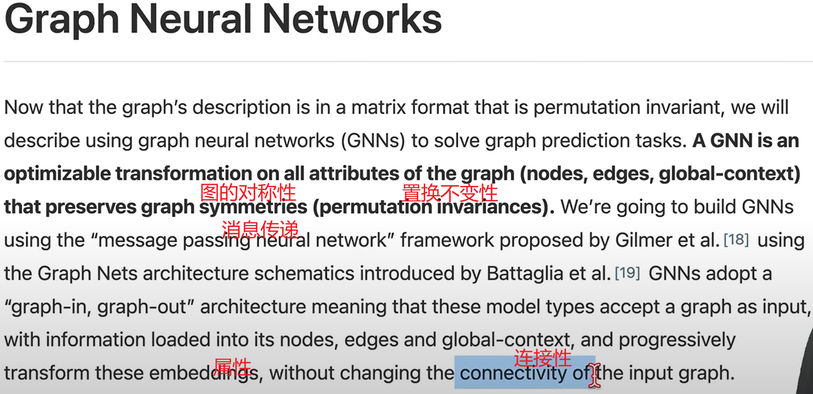
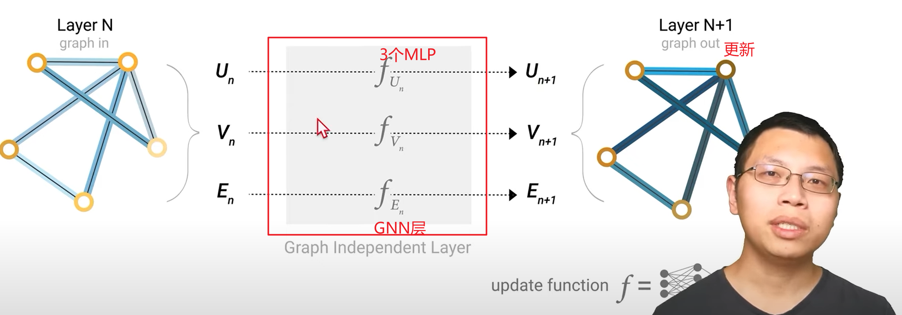

# LLM-As-an-Evaluator-For-Text-attributed-Graph-Node-Classification
Work for "LLM As an Evaluator For Text-attributed Graph Node Classification"

---

## GNN是什么？https://zhuanlan.zhihu.com/p/76175953

> 图：针对非欧几里得结构化数据表示问题，研究者们引入了图论中抽象意义上的图(Graph)来表示非欧几里得结构化数据。

* 图上的学习任务

介绍完图的基本术语之后，我们来看看有了图结构数据，我们可以进行哪些机器学习的任务

1、图节点分类任务：图中每个节点都有对应的特征，当我们已知一些节点的类别的时候，可以设计分类任务针对未知节点进行分类。我们接下来要介绍的 GCN、GraphSAGE、GAT模型都是对图上的节点分类。

2、图边结构预测任务：图中的节点和节点之间的边关系可能在输入数据中能够采集到，而有些隐藏的边需要我们挖掘出来，这类任务就是对边的预测任务，也就是对节点和节点之间关系的预测。

3、图的分类：对于整个图来说，我们也可以对图分类，图分类又称为图的同构问题，基本思路是将图中节点的特征聚合起来作为图的特征，再进行分类。

### 原理 

> 神经网络算法 - 一文搞懂GNN（图神经网络） - 文章 - 开发者社区 - 火山引擎
> https://developer.volcengine.com/articles/7382257268630224905

* GNN的架构 ： GNN包含三个主要的函数， **节点函数（node function）、边函数（edge function）和全局函数（global function）**。 这些函数共同作用于图的各个组件（节点、边和全局上下文），以产生新的嵌入或输出。

  * 节点函数：负责更新节点的嵌入，通过聚合来自邻居节点的消息。 节点函数可以是任何可微分的函数，如多层感知机（MLP）或循环神经网络（RNN）。
  * 边函数：定义如何从边传递消息到相邻节点，根据边的特性及两端节点的特征计算消息。 边函数同样可以是任何可微分的函数，如多层感知机（MLP）或循环神经网络（RNN）。
  * 全局函数：基于所有节点和边的信息生成整个图的表示，用于图级别的预测任务。 全局函数可以通过聚合所有节点的表示或应用某种形式的池化操作来实现。

* GNN的工作原理 ： GNN层中使用池化和消息传递机制，我们可以构建出更复杂的GNN模型，这些模型能够捕获图的连接性和结构信息，以做出更准确的预测。

  消息传递机制通常包括以下三个关键步骤：

  * 消息生成（Message Generation）：对于图中的每个节点，我们首先需要收集其所有相邻节点的信息（即“消息”）。 这通常是通过将相邻节点的嵌入（或特征）通过一个函数 g（例如一个线性变换或一个神经网络）来生成消息。 这些消息可以包含关于相邻节点特征的信息，以及它们与中心节点之间的关系。
  * 消息聚合（Message Aggregation）：接下来，我们需要将中心节点收到的所有消息聚合起来。这通常是通过一个聚合函数（如求和、平均、最大池化等）来完成的。 聚合函数的目的是将多个消息合并成一个单一的向量，这个向量将代表中心节点的邻域信息。
  * 节点更新（Node Update）：最后，我们使用聚合后的消息来更新中心节点的嵌入。这通常是通过将聚合后的消息通过一个更新函数（如一个神经网络）来实现的。 更新函数的作用是结合中心节点当前的嵌入和邻域信息，以产生一个新的、更丰富的嵌入。
  
  

* 图注意力网络（GAT，权重对位置不敏感，而是取决于点之间的位置关系）： 图属性之间传递信息的另一种方式是通过注意力。 GAT是一种在图神经网络（GNN）基础上引入注意力机制的模型。 这种机制允许**模型在聚合邻居节点信息时，根据节点之间的关系动态地分配不同的权重。**

  对于每条边，都会计算、归一化交互分数并用于对节点嵌入进行加权 ， 从而帮助模型更好地理解和捕捉图结构中的信息。 Transformer 可以被视为具有注意力机制的 GNN

* Graph Convolutional Network(GCN)

  为图半监督分类任务设计了一个简单并且效果好的神经网络模型，这个模型由谱图卷积(spectral graph convolution)的一阶近似推导而来，具有理论基础。

  实现时，由于GCN需要输入整个邻接矩阵A和特征矩阵X, 因此它是非常耗内存的，论文中作者做了优化，他们将A作为稀疏矩阵输入，然后通过实现稀疏矩阵和稠密矩阵相乘的GPU算子来加速计算，然而，即使这样，整个矩阵仍然存在这要被塞进内存和显存中的问题，当图规模变大的时候，这种方法是不可取的，

* GraphSAGE

  在GCN的博文中我们重点讨论了图神经网络的逐层传播公式是如何推导的，然而，GCN的训练方式需要**将邻接矩阵和特征矩阵一起放到内存或者显存里**，在大规模图数据上是不可取的。其次，GCN在训练时需要知道**整个图的结构信息**(包括待预测的节点), 这在现实某些任务中也不能实现(比如用今天训练的图模型预测明天的数据，那么**明天的节点是拿不到的**)。GraphSAGE的出现就是为了解决这样的问题

    * Inductive learning v.s. Transductive learning

        与其他类型的数据不同，图数据中的每一个节点可以通过边的关系利用其他节点的信息，这样就产生了一个问题，如果训练集上的节点通过边关联到了预测集或者验证集的节点，那么在训练的时候能否用它们的信息呢? **如果训练时用到了测试集或验证集样本的信息(或者说，测试集和验证集在训练的时候是可见的), 我们把这种学习方式叫做transductive learning**, 反之，称为inductive learning. 显然，我们所处理的大多数机器学习问题都是inductive learning, 因为我们刻意的将样本集分为训练/验证/测试，并且训练的时候只用训练样本。然而，**在GCN中，训练节点收集邻居信息的时候，用到了测试或者验证样本，所以它是transductive的**。

    * 原理
      
      GraphSAGE是一个inductive框架，在具体实现中，训练时它仅仅保留训练样本到训练样本的边。inductive learning 的优点是可以利用已知节点的信息为未知节点生成Embedding. GraphSAGE 取自 Graph SAmple and aggreGatE, SAmple指如何对邻居个数进行采样。aggreGatE指拿到邻居的embedding之后如何汇聚这些embedding以更新自己的embedding信息。下图展示了GraphSAGE学习的一个过程： 

      

      1. 对邻居采样

      2. 采样后的邻居embedding传到节点上来，并使用一个聚合函数聚合这些邻居信息以更新节点的embedding

      3. 根据更新后的embedding预测节点的标签

    * 算法细节

        

### 应用
* 社区发现（节点聚集）
* 链接预测（预测边）
* 节点分类
* 个性化推荐

---

* 卷积神经网络：假设空间变换不变性
* RNN：时序不变性
* GNN：保持图的对称性、连接性

A Gentle Introduction to Graph Neural Networks
https://distill.pub/2021/gnn-intro/

 

> 只对属性改变而不改变图的结构
> MLP只对向量作用，对顶点如何排序都不会改变结果