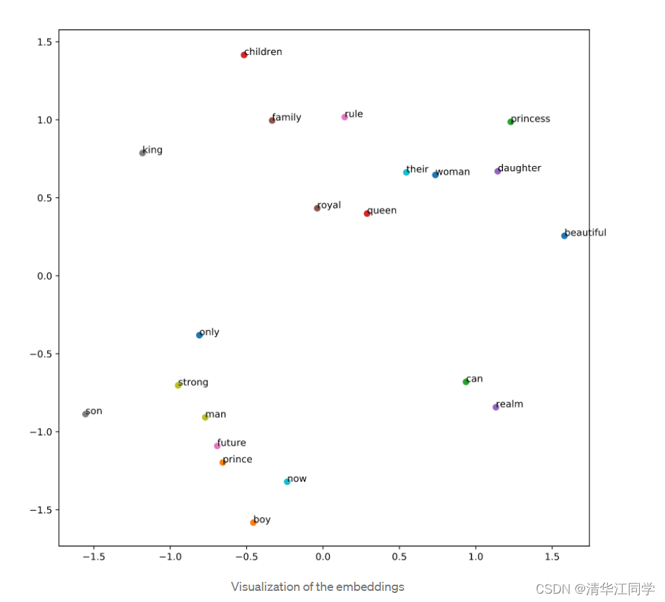

* 深度学习入门篇：说人话，到底什么是Embedding，为什么要引入它_embedding模型-CSDN博客
https://blog.csdn.net/thujiang000/article/details/122786518

先来看看谷歌的解释，应该是网上能找到最棒的版本了。

Embedding是一个相对低维的空间，可以将高维向量转换到其中。Embedding使得机器学习更容易在大规模的输入上进行，比如表示单词的稀疏向量。理想情况下，Embedding通过将语义相似的输入紧密地放置在Embedding空间中来捕获输入的一些语义。Embedding可以跨模型学习和重用。

这个解释已经很通俗易懂了，但我相信对于很多机器学习小白来说还是有点儿摸不着头脑。

废话不多说，直奔主题。先来看两句话。

人每天都要吃饭。

人每天都要喝水。

以上两句话，除了吃饭和喝水不一样，完全相同。吃饭和喝水之间有没有某种相似性？它们都是动物每天所必须进行的活动。这两个词在句子中还有一个相似点，那就是都处于“人每天都要”这个词组旁边。这似乎便启发了我们一件事，是不是可以通过某个词所在的文本语境，来给这个词赋予意义。

例如，我们要定义吃饭，可以从网上爬取数以万计带着吃饭二字的文段。

吃饭是人摄入负熵维持耗散体系的主要方式。

人人都想要健康，而健康身体的一个重要基础，是按时吃饭。

……

我们可以定义一组向量，用这个词所嵌入的环境来定义这个向量的值。这样的编码方式与传统的one-hot编码相比，节约了大量的空间。并且在Embedding向量空间中相邻的点，还具有相近的含义。

 而Embedding具体的编码过程，需要用到神经网络，我们下期再讲
